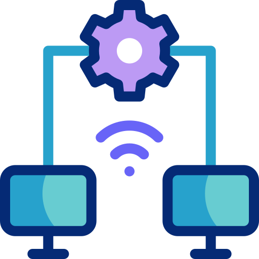

 Olá, Me chamo Lucas Davi

Sobre mim
 

 Ciência da Computação - UECE
 Bolsista no LARCES - UECE
 
terminei o técnico integrado em informática no IFCE e estou cursando Ciência da Computação na UECE. Tenho interesse em estudar para me tornar um programador fullstack, atuando no back e no front, onde tenho mais conhecimento.Atualemte sou bolsista no LARCES (Laboratório de Redes e Segurança), onde estudo e desenvolvo projetos em IoT. Pretendo desenvolver ainda mais meus conhecimentos ao longo da graduação.

---

  Linguagens e Tecnologias
          

 
 
 Contact

- 📧 Email: [lucasdavi.barros22@gmail.com](mailto:lucasdavi.barros22@gmail.com)
- 💼 LinkedIn: [linkedin.com/in/lucas-davi-81a63523b](https://www.linkedin.com/in/lucas-davi-81a63523b/)
